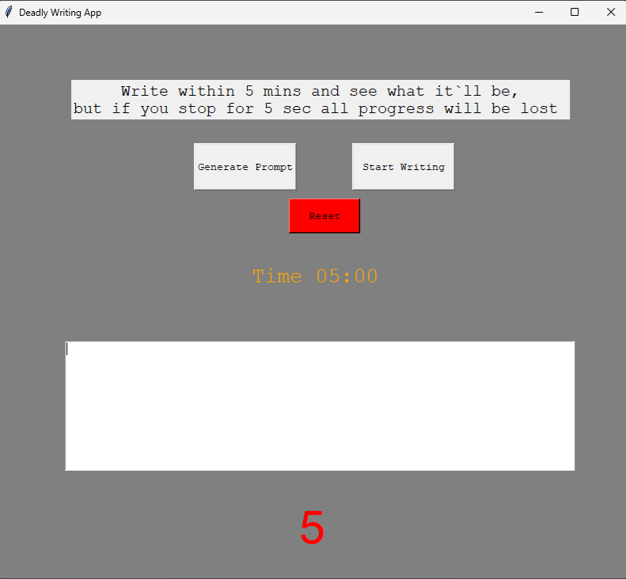

# Deadly Writing App

A Tkinter-based writing challenge app where you must keep writing within 5 minutes. If you stop for 5 seconds, you lose all progress!

## Features
- Generates a random writing prompt.
- Starts a countdown timer for 5 minutes.
- Tracks idle time (5 seconds limit).
- Resets and restarts easily.

## Screenshot


## Installation
1. Clone this repository:
   ```bash
   git clone https://github.com/amorproje/Deadly-Writing-App.git
